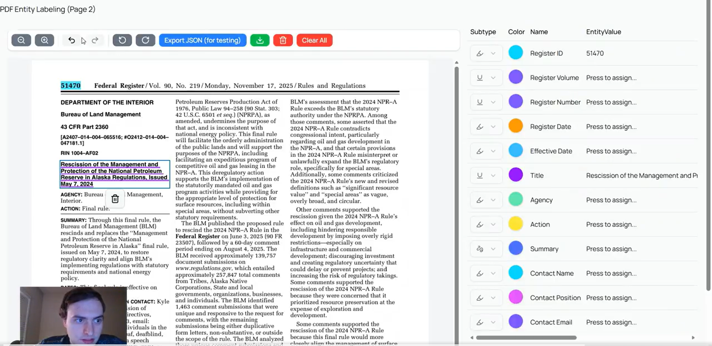

# PDF Entity Labeling

## 1 Minute Demo (Click Below! ⬇️)

[](https://x.com/i/status/1998581605468918028)

## Idea

### The Problem

Every business is modernizing big data processes, but what about information that isn't stored in a database or transferred in EDI format? Most unstructured, confidential information is sent as PDFs. These PDFs are often read once and discarded, or a human has to spend valuable time recording the details. Even tech-forward businesses rely on analysts to read PDFs and manually enter fields or trigger actions in their software systems.

### The Solution

NER automates PDF reading. Extracting key features converts your PDFs into an SQL database. From there, you can easily finalize an automation workflow to execute your business logic or mine insights on data you didn't realize you had.

### Core functionality

In-browser PDF labeling to enable NER (named entity recognition) model training. The page displays a PDF on the left and a table of entities on the right. The user can label the text in the PDF that corresponds to each entity type in the table. The annotation objecs, including the entity type, and text, are saved to JSON or could be passed to a database and backend to train models. The user can choose the color and whether highlight/underline/squiggly for each entity type in the table, as well as delete annotations from the table.

### User Steps

1. Describe entity types - give each variable a name, written definition, and constraints for data type, required, and unique
1. Label Documents - use the intuitive web interface to label examples of finding the features in the documents
1. Train Model - train a custom SLM/trasnformer using the labeled data or use the defintions and examples to craft a comprehensive prompt for an LLM to achieve high accuracy without training
1. Check outputs - create annotations for the predicted labels and siaply the PDFs in the UI to verify each output visually and make corrections to the model or the output before it is used in prod

## Preview site locally

1. Install [Node.js v22](https://nodejs.org/en/download/) and [Git](https://git-scm.com/downloads)
2. Clone repo and install dependencies:

```cmd
git clone https://github.com/optimalcharb/pdf-entity-labeling.git
```

```cmd
npm install
```

3. Run the server

```cmd
npm run dev
```

## Development Tools

### Core Frontend

- Frontend framework: [Next.js 15](https://nextjs.org/) App Router + [React](https://react.dev/)
- Language: [TypeScript](https://www.typescriptlang.org/) with [ts-reset](https://github.com/total-typescript/ts-reset), config by tsconfig.json
- Environment variable management: no environment variables, for now all variables should be hard-coded, loaded from an annotations file, or user provided
- Containerization: none, no Docker or Kubernetes
- Styles: [Tailwind CSS v4](https://tailwindcss.com/) with [CVA](http://cva.style/) (Class Variance Authority) for CSS integration and [PostCSS](https://postcss.org/) for JavaScript integration
- Linting: [ESlint 9](https://eslint.org/), config by eslint.config.mjs
- Formatting: [Prettier](https://prettier.io/), config by .prettierignore, .prettierrc
- Testing: [React Testing Library](https://testing-library.com/react) + [Bun Test Runner](https://bun.com/docs/test/writing) which is based on Jest, name files as ".{spec,test}.{ts,tsx}"
- End-to-End Testing: [Playwright](https://playwright.dev/), name files as ".e2e.ts"

### Backend for Frontend (BFF)

- Storage: must get PDF from local storage or URL

### Core Backend

- None

### Scripts

| Script       | Description                                                |
| ------------ | ---------------------------------------------------------- |
| dev          | run site locally                                           |
| build        | build for prod                                             |
| start        | start prod server                                          |
| tsc          | compile types without generating files                     |
| lint         | check for linting errors                                   |
| lint:fix     | fix some linting errors automatically                      |
| prettier     | check format                                               |
| prettier:fix | fix format (.vscode/settings.json does this on every save) |
| prepare      | automatically called by install                            |
| postinstall  | automatically called by install                            |
| depcheck     | check for unused dependencies                              |
| storybook    | view storybook workshop                                    |
| test         | run tests using Bun Test Runner                            |
| e2e          | run playwright end-to-end tests                            |
| others       | other scripts can be added to package.json                 |

### Version Control

- DevOps CI/CD: [GitHub Actions](https://github.com/features/actions) with workflows for check and bundle analyzer - currently disabled
- Changelog generation: [Semantic Release](https://github.com/semantic-release/semantic-release) config by .releaserc and ran by .github/workflows/semantic-release.yml, [Conventional Commits](https://www.conventionalcommits.org/) enforced by [husky](https://github.com/typicode/husky) config by .commitlintrc.json, commit messages must start with a prefix in the table below, the workflow edits CHANGELOG.md on any version bump

| commit prefix | version bump           | definition                                 |
| ------------- | ---------------------- | ------------------------------------------ |
| type!:        | major (0.0.0 -> 1.0.0) | breaking changes (`feat!:`, `perf!:`, ...) |
| feat:         | minor (0.0.0 -> 0.1.0) | new feature                                |
| perf:         | patch (0.0.0 -> 0.0.1) | performance improvement                    |
| fix:          | patch (0.0.0 -> 0.0.1) | bug fix                                    |
| docs:         | none                   | documentation changes                      |
| test:         | none                   | adding or updating tests                   |
| ci:           | none                   | CI/CD configuration changes                |
| revert:       | none                   | reverting previous commits                 |
| style:        | none                   | formatting without code changes            |
| refactor:     | none                   | reorganizing code without changes          |
| chore:        | none                   | maintenance tasks                          |
| build:        | none                   | build system or dependencies               |

### Dependency Control

- Package manager: [npm](https://docs.npmjs.com/about-npm)
- Package management: [Corepack](https://github.com/nodejs/corepack)
- Package fixes: [Patch-package](https://www.npmjs.com/package/patch-package)
- Bundle management: [Bundle analyzer](https://www.npmjs.com/package/@next/bundle-analyzer) - currently disabled
- Import management: [Absolute imports](https://nextjs.org/docs/advanced-features/module-path-aliases) so imports from same module are alphabetically ordered

### Component Development

- State management: React or local state and [zustand](https://github.com/pmndrs/zustand) for global state stores
- Component workshop: [Storybook](https://storybook.js.org/) using .stories.tsx files

## Features

### PDF Rendering

- EmbedPDF: [GitHub](https://github.com/embedpdf/embed-pdf-viewer), [docs for @embedpdf/pdfium](https://www.embedpdf.com/docs/pdfium/introduction) the JS library to wrap the C++ engine, [docs for @embedpdf/core](https://www.embedpdf.com/docs/react/introduction) which I have modified
- Plugins are built in consitent style defined by core (not using standard Redux style) and must have commented sections following plugin-template/

### UI Libraries

- [shadcn/ui](https://ui.shadcn.com/) stored in components/shadcn-ui and config by components.json

### Icons

- [Lucide Icons](https://lucide.dev/icons/)
